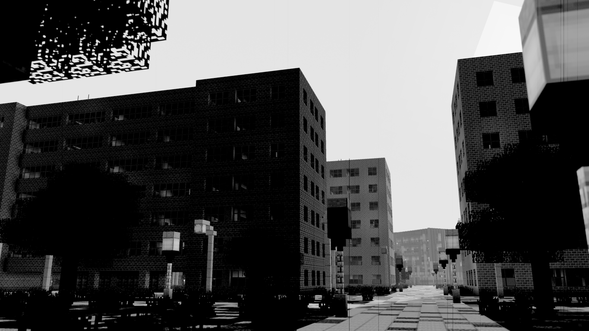
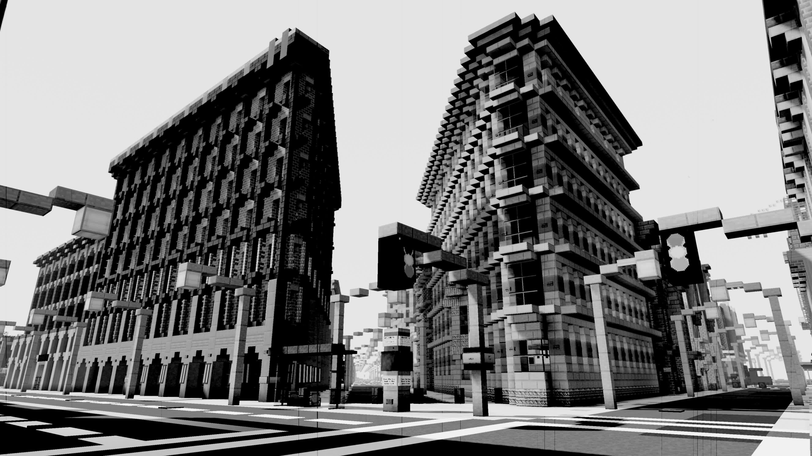
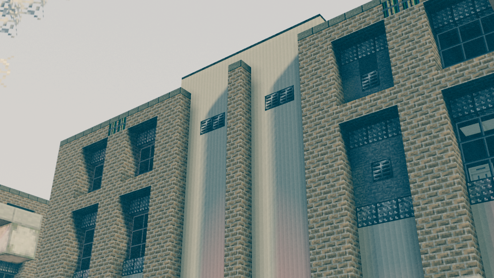
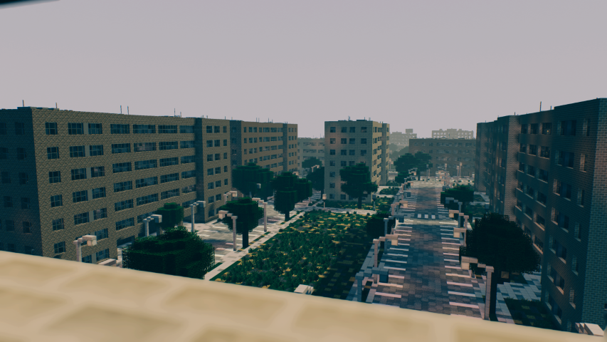
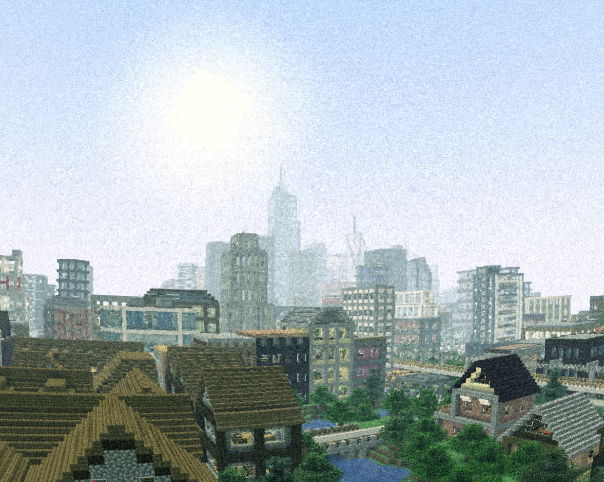

# [Epoch](https://www.google.com/search?q=define+epoch)
## /ˈiːpɒk,ˈɛpɒk/
**noun:**

a particular period of time in history or a person's life.
	
*"the Victorian epoch"*

#### Features include
- Scanlines
- Chroma Subsampling
- Depth of Field
- B&W and Color film modes
- Among many others!

#### Todo:
- BIGFOOT AND UFOS!!!!!!
- Random digital and analogue glitches and transforms.
- Dimensional rewind effect
- Light leaks
- Anamorphic effects
- Other lens effects
	- Flares
- Flashlight
- Physical-ish sky

    
    
    
    
    
    

### BUFFER USAGE:

buffer|Read|Write|composite0|composite3|composite6|composite15
------|----|-----|----------|----------|----------|-----------
colortex0|0 3 6 15|GB 0 3 6 15|color.rgb, coc.a|color.rgb, filmspot.a|color.rgb|color.rgb
colortex1|3 15|3 15|N/A|color.rgb delayed|N/A|exposure.a
colortex2|GB 3 6|6|N/A|N/A|color.rgb accum|N/A
colortex3|2|6|N/A|N/A|CRT Texture|N/A
colortex4|3|0 1 2|N/A|Bloom|N/A|N/A
